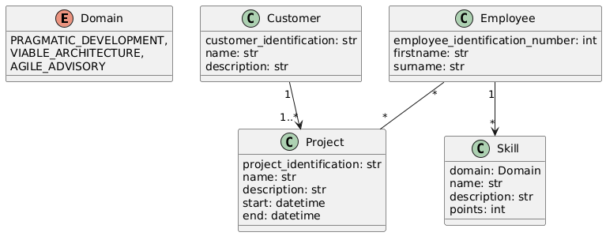
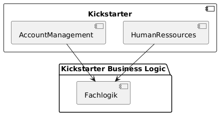

# 1. Einfuehrung und Ziele

Dieses Projekt demonstriert den Aufbaue einer Webanwendung in Python.
Daher ist die Architektur moeglichst einfach aufgebaut und der Funktionsumfang eingeschraenkt.
Addressierte Interessenten sind vor allem diejenigen, die schnell ein funktionsfaehiges Projekt auf die
Beine stellen wollen.

# 2. Einschraeknungen

Zur Authentifizierung soll ein Keycloak verwendet werden.
Das Backend wird mit Hilfe von Django umgesetzt.
Der Kern der Anwendung soll in einem importierbaren Pythonpacket ausgelagert zur Verfueging stehen.

# 3. Kontext und Umfang

Grenzt Ihr System von seinen (externen) Kommunikationspartnern (benachbarten Systemen und Benutzern) ab.
Spezifiziert die externen Schnittstellen.
Aus einer geschäftlichen/fachlichen Perspektive dargestellt (immer) oder aus technischer Perspektive (optional).

https://docs.arc42.org/section-3/

In diesem Szenario existieren zwei Domaenen:

    - Account Management
    - Human Ressources

Das Account Management kuemmert sich um Kunden und die von ihnen beauftragten Projekte.
Human Ressources verwalten die Angestellten und weisen sie einem Projekt zu.

# 4. Loesungsstrategien

Zusammenfassung der grundlegenden Entscheidungen und Lösungsstrategien, die die Architektur prägen.
Kann die Technologie, die oberste Ebenendekomposition,
Ansätze zur Erreichung der wichtigsten Qualitätsziele und relevante organisatorische Entscheidungen umfassen.

In diesem Projekt wird eine Webanwendung entwickelt, die auf eine als Bibliothek gelieferte fachliche Logik zugreift.

# Zerlegung der Anwendung

Die Anwendung wird in mehrere Teile Zerlegt.
    1. Eine Django Webanwendung mit zwei Apps.
        1.1 Employees - Kuemmert sich um die Verwaltung von Angestellten.
        1.2 Skillprofil - Kuemmert sich um die Pflege und Dokumentation der Faehigkeiten Angestellter.
    2. Die Fachlogik, die das Verhalten umsetzt.

# kickstarter/

Eine Webanwendung, umgesetzt mit Hilfe von Django, die eine Django App "Skillprofil" und eine Django App "Employees" bereit stellt.
Die Webanwendung stellt die notwendigen REST Endpunkte bereit um mit dem Fachmodell zu interagieren.
Die beiden Django Apps stellen zusaetzlich eine Persistenzschicht fuer den Zugang zum Entitaetenmodell bereit.

# kickstarter_business_logic/

Enthaelt eine installierbare Bilbiothek mit der Fachlogik.
Die Fachlogik enthaelt Funktionen zum Verwalten von Angestellten und modelliert den Ablauf beim erstellen von Skillprofilen.

https://docs.arc42.org/section-4/

# 5. Bausteinsicht

Statische Zerlegung des Systems, Abstraktionen des Quellcodes, dargestellt als Hierarchie von weißen Kästen (die schwarze Kästen enthalten), bis zum geeigneten Detaillierungsgrad.

https://docs.arc42.org/section-5/

# 6. Laufzeitsicht

Verhalten der Bausteine als Szenarien, die wichtige Anwendungsfälle oder Funktionen abdecken,
Interaktionen an wichtigen externen Schnittstellen,
Betrieb und Verwaltung sowie Fehler- und Ausnahmeverhalten.

https://docs.arc42.org/section-6/

# 7. Bereitstellungssicht

Technische Infrastruktur mit Umgebungen, Computern, Prozessoren, Topologien.
Zuordnung von (Software-)Bausteinen zu Infrastrukturelementen.

https://docs.arc42.org/section-7/

# 8. Uebergreifende Belange / Crosscutting Concerns

Insgesamt sind dies die hauptsächlichen Vorschriften und Lösungsansätze,
die in mehreren Teilen des Systems relevant sind (→ übergreifend).
Die Konzepte sind oft mit mehreren Bausteinen verbunden.
Enthalten verschiedene Themen wie Domänenmodelle, Architekturmuster und -stile,
Regeln zur Verwendung spezifischer Technologien und Implementierungsregeln.

https://docs.arc42.org/section-8/

# 9. Architekturentscheidungen / Architectur Decision Records

Wichtige, kostenintensive, kritische, groß angelegte oder risikoreiche Architekturentscheidungen einschließlich Begründungen.

https://docs.arc42.org/section-9/

# 10. Qualitaetsanforderungen

Qualitätsanforderungen als Szenarien, mit Qualitätsbaum zur Bereitstellung eines Überblicks auf hoher Ebene.
Die wichtigsten Qualitätsziele sollten in Abschnitt 1.2 (Qualitätsziele) beschrieben worden sein.

https://docs.arc42.org/section-10/

# 11. Risiken und technische Schuld

Bekannte technische Risiken oder technische Schulden.
Welche potenziellen Probleme bestehen innerhalb oder um das System herum?
Über welche Aspekte fühlt sich das Entwicklungsteam unglücklich?

https://docs.arc42.org/section-11/

# 12. Glossar

Wichtige Fach- und Technikbegriffe, die Stakeholder verwenden, wenn sie über das System diskutieren.
Ebenfalls: Übersetzungsreferenz, wenn Sie in einer mehrsprachigen Umgebung arbeiten.

https://docs.arc42.org/section-12/

| Bezeichnung       | Beschreibung |
|-------------------|--------------|
|Entitaet           |Hier eine Bezeichnung auf Datenbankebene, beschreibt ein Tabellenschema im Zusammenhang zu einem fachlichen Objekt.|
|Entitaetenmodell   |Ein Modell bestehend aus Entitaeten.|

# Weiteres

https://arc42.org/overview#solution-strategy
